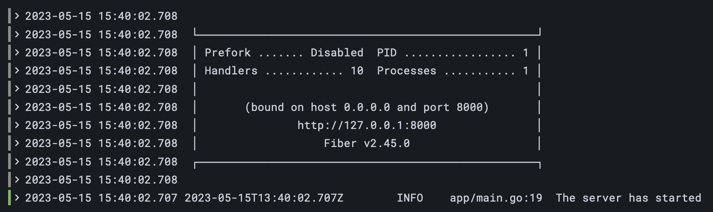
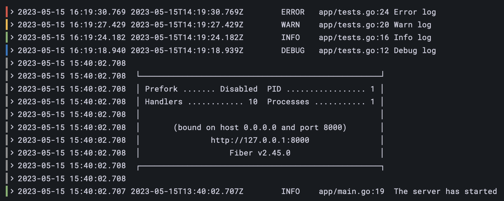

# golog


A loki-based logging stack example with Go.

The docker-compose creates 4 services:

- `promtail` is the agent, responsible for gathering logs and sending them to Loki.
- `loki` is the main server, responsible for storing logs and processing queries.
- `grafana` for querying and displaying the logs.
- `app` is the go basic app that uses `fiber` as http engine and `zap` as logger.

## Usage

Start docker-compose services:

```sh
make local.docker.up.build
```

## Example 1

Access Grafana on http://localhost:3000
- go to explore tab on the left
- select container as label filter
- we can see an info log from the Go app

### Grafana explorer view :

<p align="center"></p>

## Example 2

The Go app is running on http://localhost:8000

In the [tests](/app/tests.go) file, there are handlers to trigger several logs levels:

```sh
curl localhost:8000/tests/debug     // trigger a debug log
curl localhost:8000/tests/info      // trigger an info log
curl localhost:8000/tests/warn      // trigger a warning log
curl localhost:8000/tests/error     // trigger an error log
curl localhost:8000/tests/various   // trigger all levels several times
```

### Grafana explorer view :

<p align="center"></p>